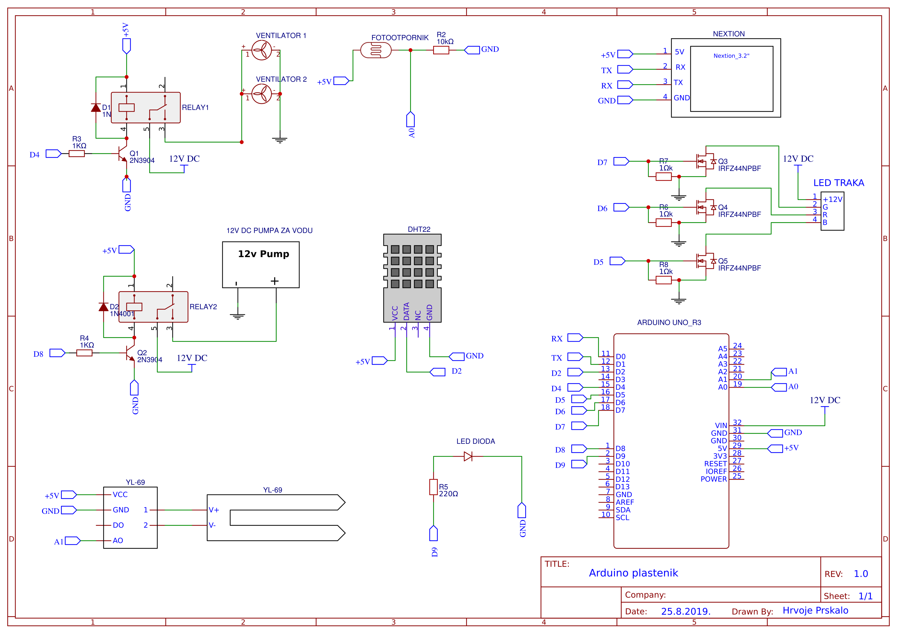

# Automated greenhouse model

For my Final Year project I have decided to design an Automated greenhouse model. The goal of project was to regulate temperature, humidity, soil moisture and luminosity level. Arduino is receiving data from sensors and depending on the setpoints it switches fans, LED strip, water pump and LED diod(indicator that temperature is too low) ON or OFF. Every measurement is displayed on Nextion touchscreen display. Thanks to touchscreen it's possible to set different setpoints.

### Components
- Arduino UNO
- Nextion display
- Temperatureand humidity sensor - DHT22
- Soil moisture sensor – YL 69
- Photoresistor  (LDR)
- Relay SRD-05VDC-SL-C
- LED strip
- Power supply 12V DC
- FAN x2
- Water pump
- Resistors
- MOSFET transistor
- Plexiglass

### Schematics

All components are wired as shown on picture below. You can also find each component wireing in Pics/Schematic folder.

## Final product

### Greenhouse model

 

 

### Nextion display

Display is showing ambient temperature, humidity, soil moisture and luminosity level. Secound part of display is for setting MIN and MAX setpoint value for temperature and humidity. Water pump and LED strip are turned ON/OFF depended on fixed values in Arduino code. 

